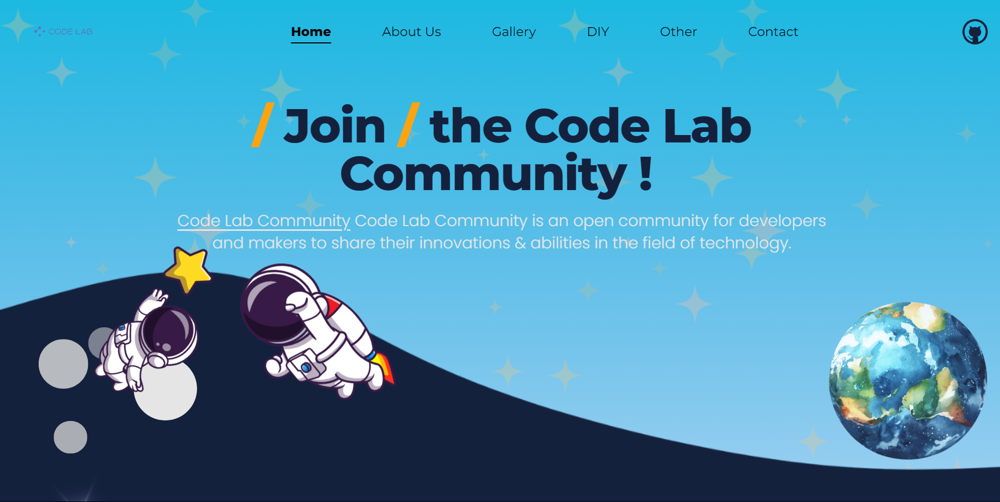

# Code Lab Community | `Landing Page`

   

## 🌍 About

`Code Lab Community` is an open community for developers and creators to share their innovations & abilities in the field of technology created by [Muhammad Bobby](https://www.instagram.com/code.lab_indonesia) & [Auliya Ikhsana](https://www.instagram.com/code.lab_indonesia).

## 📸 Screenshots



## ✨ Pages & Menus

- `Landing Page` : Home, About Us, Contact Us, and various other menu summaries.
- `Gallery` : a collection of images about the latest innovations and a gallery of featured projects from the community.
- `Tutorial (DIY)` : All about Step by step guides for various tutorial projects shared by the community.
- `Event` : a variety of information about upcoming meetups, hackathons, webinars and workshops.
- `Blog/News` : various articles, blogs and the latest news related to the world of technology.

## Demo

Start demo : [portfolio](https://muhammadbobby.github.io/portfolio-muhammad-bobby/)

## ✅ Run Locally

Clone the project into a local server like XAMPP or Laragon

```bash
  git clone https://github.com/MuhammadBobby/Lomba-ITechno-Cup-2024.git
```

Go to the project directory

```code
  cd Lomba-ITechno-Cup-2024
```

Open code in IDE like Visual Studio Code

```code
  code .
```

OPen your terminal, install all necessary dependencies & run dependencies before starting :

```code
  npm install
  npm run dev
```

#### Don't forget to activate your internet 🚀

## 💪 Resources

- `Tailwind CSS`
- `Flowbite`
- `Google Fonts`
- `Unsplash Images`
- `Font Awesome Icons`

## 🔗 Links

### Teams

**Muhammad Bobby** :

[](https://muhammadbobby.github.io/portfolio-muhammad-bobby/)

[](https://www.linkedin.com/in/muhammadbobby30/)

[](https://www.instagram.com/code.lab_indonesia)

**Auliya Ikhsana** :

[](https://bit.ly/auliya_portofolio)

[](http://www.linkedin.com/in/auliyanasution)

[](https://www.instagram.com/code.lab_indonesia)

## Authors

- [Muhammad Bobby](https://www.github.com/MuhammadBobby)
- [Auliya Ikhsana](https://www.github.com/AuliyaIkhsanaNasution)
